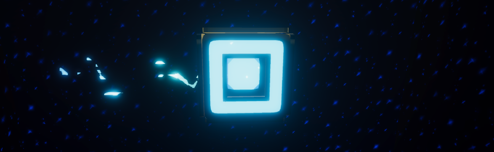

# **[INVERSIA](https://github.com/eiparfenov/InversiaAssets)**

## VR Game

Игра, сделанная как вступительное испытание в RTUITLab по направлению "Создание виртуальных приложений".  
В игровом пространстве свет поменялся местами с тенью; отсюда и берется название игры - инверсия.  
Игра стилизована под неоновый виртуальный мир с намеком на ретро-аркады, заключенный в куб.  
Внтури этого куба находится игровое 3D-пространство, и, как проекция на одну из сторон, - 2D-пространство.  
В 3D-пространстве разбросаны блоки, а на 2D-пространстве изображены их неоновые проекции - инверсированные тени, которые под инверсией принимают материальные свойства.  
Главный герой игры - призрак, который застрял на платформе 3D-пространства. Он не умеет ни прыгать, ни летать, лишь плыть по поверхности физических объектов, поэтому блоки в 3D-пространстве не помогают ему в передвижении - они располагаются слишком далеко друг от друга. Однако призрак, как известный герой аркады, может проецироваться на экран, чем он и пользуется - он телепортируется на стену с инверсированными тенями от блоков, которые могут помочь ему попасть на нужную платформу.  
Задача игрока - довести призрака до платформы.

## Геймплей

В 3D-пространстве можно взаимодействовать с блоками с помощью контроллеров. При смене их позиции также изменяется их тень-проекция. Некоторые блоки можно двигать лишь по фиксированным осям, некоторые - только поворачивать. Блоки объединены в фигуры, в которых они передвигаются вместе.  
В 2D-пространстве с помощью трек-пада на контроллере можно передвигать призрака вперед и назад. Призрак может передвигаться по проекциям, но если он упадет, уровень перезапустится.  
Пока в игре представлены 3 демонстрационных уровня, между которыми можно переключаться с помощью UI справа от игрока.  
В первом и втором уровне представлены механики перетаскивания фигур по вертикали и горизонтали , в третьем - механика поворота. Каждой механике соответствует свой цвет фигуры.  
Скриншоты в последний день сделать забыли; но весь геймплей показан в демонстрационном ролике в гугл-диске.  

## Графика и ассеты

Сторонние ассеты практически не использовались; только предоставленные подключенными плагинами + открытый шрифт.  

## Технологии и техника

**Unity 2020.3.30f1**  
Плагины:  
**OpenXR Plugin 1.1.4**  
**XR Plugin Managment 4.2.1**  
**Universal RP 10.8.1**  
**Visual Effect Graph 10.8.1**  
>Для воссоздания проекта в Unity следует создать новый проект нужной версии, заменить содержимое папки Asset на содержимое репозитория, и подключить перечисленные плагины. Легче, конечно, будет скачать весь проект архивом из гугл-диска. Мы были вынуждены так сделать, потому что LFS не работает стабильно с содержимым проектов Unity.

При тестировании использовались:  

VR-очки HTC Vive + контроллеры  
**SteamVR 1.21**  

## Запись экрана, архивы с проектом и билдом

## **[Гугл-диск](https://drive.google.com/drive/folders/1S3JETjcsjNniz6xjcXlpvom9BXt06pB5?usp=sharing)**
>Билд создан под Windows + SteamVR, игра исключительно VR

## Контакты
>Если интересно, то Егор отвечал за логику, Яна - за графику. Левел/геймдизайн - общая работа.
### Парфенов Егор, ИНБО-01-20 &emsp; [][1]  [][2]

### Тришина Яна, ИНБО-11-20 &emsp; [][3]  [][4]  
___
РТУ МИРЭА, ИИТ

[1]: https://github.com/eiparfenov
[2]: https://vk.com/eiparfenov
[3]: https://github.com/etoxotic
[4]: https://vk.com/etoxotic
